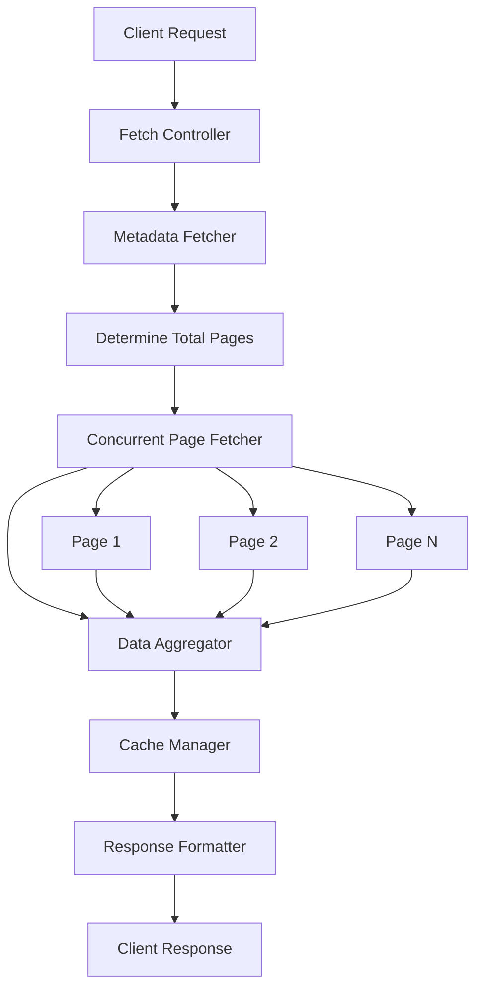

# Design Document

## Overview

This design document outlines the architecture for implementing comprehensive tender data fetching that retrieves all available open tenders with complete information while maintaining high performance. The solution addresses the current limitation of fetching only a subset of tenders and ensures all required tender details are captured for display in the tender detail pages.

The design focuses on performance optimization through concurrent API requests, intelligent caching, efficient data processing, and progressive loading strategies to handle large datasets effectively.

## Architecture

### Current System Analysis

The existing system has these characteristics:

- **API Endpoint**: `https://ocds-api.etenders.gov.za/api/OCDSReleases`
- **Current Pagination**: Limited to PageNumber=5, PageSize=50 (only 50 tenders)
- **Date Range**: Fixed to 2025-01-01 to 2025-03-31
- **Data Structure**: OCDS (Open Contracting Data Standard) format
- **Performance**: Single API call with limited data

### Proposed Architecture Improvements

#### 1. Multi-Stage Data Fetching Strategy



#### 2. Performance-Optimized Data Flow

1. **Discovery Phase**: Determine total available data
2. **Concurrent Fetching**: Parallel API requests for all pages
3. **Stream Processing**: Process data as it arrives
4. **Intelligent Caching**: Cache with TTL and invalidation
5. **Progressive Response**: Return data incrementally

## Components and Interfaces

### Core Data Fetching Components

#### 1. Comprehensive Tender Fetcher Service

```typescript
interface TenderFetcherConfig {
  maxConcurrentRequests: number;
  requestTimeout: number;
  retryAttempts: number;
  cacheTimeout: number;
  dateRange?: {
    from: string;
    to: string;
  };
}

interface TenderFetchResult {
  tenders: Release[];
  totalCount: number;
  fetchedCount: number;
  errors: FetchError[];
  performance: PerformanceMetrics;
}

interface PerformanceMetrics {
  totalFetchTime: number;
  averageRequestTime: number;
  cacheHitRate: number;
  errorRate: number;
}

class ComprehensiveTenderFetcher {
  async fetchAllOpenTenders(
    config?: TenderFetcherConfig
  ): Promise<TenderFetchResult>;
  async fetchTenderBatch(pageNumbers: number[]): Promise<BatchResult>;
  private async discoverTotalPages(): Promise<number>;
  private async fetchPage(pageNumber: number): Promise<PageResult>;
}
```

#### 2. Enhanced API Route Structure

```typescript
// /api/tenders/comprehensive/route.ts
interface ComprehensiveApiResponse {
  data: {
    releases: Release[];
    pagination: {
      totalCount: number;
      fetchedCount: number;
      totalPages: number;
      fetchedPages: number[];
    };
    performance: PerformanceMetrics;
    lastUpdated: string;
  };
  errors?: FetchError[];
  warnings?: string[];
}

// /api/tenders/stream/route.ts - For progressive loading
interface StreamResponse {
  chunk: Release[];
  progress: {
    completed: number;
    total: number;
    percentage: number;
  };
  isComplete: boolean;
}
```

#### 3. Enhanced Data Models

```typescript
// Extended tender information interfaces
interface EnhancedTenderInfo {
  // Core OCDS data
  ocid: string;
  tender: Tender;

  // Enhanced fields for comprehensive display
  requestForBid: {
    department: string;
    bidDescription: string;
    deliveryLocation: string;
  };

  keyDates: {
    openingDate?: string;
    closingDate: string;
    modifiedDate?: string;
  };

  contactInformation: {
    contactPerson?: string;
    email?: string;
    telephone?: string;
    fax?: string;
  };

  briefingSession?: {
    hasBriefing: boolean;
    isCompulsory?: boolean;
    date?: string;
    venue?: string;
  };

  specialConditions?: string[];
}

// Data transformation interfaces
interface TenderDataTransformer {
  transformOCDSToEnhanced(release: Release): EnhancedTenderInfo;
  extractContactInfo(parties: Party[], tender: Tender): ContactInformation;
  extractBriefingInfo(tender: Tender): BriefingSession | undefined;
  extractSpecialConditions(tender: Tender): string[];
}
```

### Caching and Performance Components

#### 1. Intelligent Cache Manager

```typescript
interface CacheConfig {
  ttl: number; // Time to live in milliseconds
  maxSize: number; // Maximum cache size
  compressionEnabled: boolean;
}

interface CacheEntry<T> {
  data: T;
  timestamp: number;
  accessCount: number;
  lastAccessed: number;
}

class TenderCacheManager {
  private cache: Map<string, CacheEntry<any>>;

  async get<T>(key: string): Promise<T | null>;
  async set<T>(key: string, data: T, customTTL?: number): Promise<void>;
  async invalidate(pattern: string): Promise<void>;
  async getStats(): Promise<CacheStats>;
  private cleanup(): void;
}
```

#### 2. Concurrent Request Manager

```typescript
interface RequestQueueItem {
  pageNumber: number;
  priority: number;
  retryCount: number;
}

class ConcurrentRequestManager {
  private queue: RequestQueueItem[];
  private activeRequests: Map<number, Promise<PageResult>>;
  private maxConcurrent: number;

  async processQueue(): Promise<BatchResult>;
  private async executeRequest(item: RequestQueueItem): Promise<PageResult>;
  private handleRateLimit(retryAfter: number): Promise<void>;
}
```

### Frontend Integration Components

#### 1. Progressive Loading Hook

```typescript
interface UseComprehensiveTendersOptions {
  enableStreaming?: boolean;
  cacheEnabled?: boolean;
  refreshInterval?: number;
}

interface ComprehensiveTendersState {
  tenders: EnhancedTenderInfo[];
  loading: boolean;
  progress: {
    loaded: number;
    total: number;
    percentage: number;
  };
  error: ApiError | null;
  performance: PerformanceMetrics | null;
}

function useComprehensiveTenders(options?: UseComprehensiveTendersOptions): {
  state: ComprehensiveTendersState;
  actions: {
    refresh: () => Promise<void>;
    loadMore: () => Promise<void>;
    clearCache: () => void;
  };
};
```

#### 2. Enhanced Tender Listing Component

```typescript
interface EnhancedTenderListingProps {
  enableVirtualScrolling?: boolean;
  pageSize?: number;
  enableFiltering?: boolean;
  enableSearch?: boolean;
}

interface TenderListingState {
  filteredTenders: EnhancedTenderInfo[];
  searchQuery: string;
  filters: TenderFilters;
  sortConfig: SortConfig;
  virtualScrollConfig: VirtualScrollConfig;
}
```

## Error Handling

### Comprehensive Error Management Strategy

#### 1. Error Classification

```typescript
enum ErrorType {
  NETWORK_ERROR = "network",
  API_ERROR = "api",
  RATE_LIMIT = "rate_limit",
  TIMEOUT = "timeout",
  PARSING_ERROR = "parsing",
  CACHE_ERROR = "cache",
}

interface FetchError {
  type: ErrorType;
  message: string;
  pageNumber?: number;
  retryable: boolean;
  retryAfter?: number;
  originalError?: Error;
}
```

#### 2. Resilient Fetching Strategy

```typescript
class ResilientFetcher {
  private async fetchWithRetry(
    pageNumber: number,
    maxRetries: number = 3
  ): Promise<PageResult> {
    let lastError: FetchError;

    for (let attempt = 1; attempt <= maxRetries; attempt++) {
      try {
        return await this.fetchPage(pageNumber);
      } catch (error) {
        lastError = this.classifyError(error, pageNumber);

        if (!lastError.retryable || attempt === maxRetries) {
          throw lastError;
        }

        await this.waitForRetry(attempt, lastError.retryAfter);
      }
    }

    throw lastError!;
  }

  private async handlePartialFailure(
    results: (PageResult | FetchError)[]
  ): Promise<TenderFetchResult> {
    const successful = results.filter((r) => !(r instanceof Error));
    const errors = results.filter((r) => r instanceof Error) as FetchError[];

    return {
      tenders: successful.flatMap((r) => r.releases),
      totalCount: this.estimateTotalCount(successful, errors),
      fetchedCount: successful.length,
      errors,
      performance: this.calculateMetrics(results),
    };
  }
}
```

### User Experience Error Handling

#### 1. Progressive Error Display

```typescript
interface ErrorDisplayStrategy {
  showPartialResults: boolean;
  retryFailedPages: boolean;
  fallbackToCache: boolean;
  userNotification: "toast" | "banner" | "modal";
}

class UserErrorHandler {
  handleFetchErrors(
    errors: FetchError[],
    strategy: ErrorDisplayStrategy
  ): UserFeedback {
    if (strategy.showPartialResults && errors.length < 50) {
      return {
        type: "warning",
        message: `Loaded ${this.getSuccessCount()} tenders. ${
          errors.length
        } pages failed to load.`,
        actions: ["retry_failed", "continue"],
      };
    }

    return {
      type: "error",
      message: "Failed to load tender data. Please try again.",
      actions: ["retry_all", "use_cache"],
    };
  }
}
```

## Testing Strategy

### Performance Testing

#### 1. Load Testing Scenarios

```typescript
interface LoadTestScenario {
  name: string;
  concurrentUsers: number;
  requestPattern: "burst" | "sustained" | "gradual";
  expectedResponseTime: number;
  expectedThroughput: number;
}

const loadTestScenarios: LoadTestScenario[] = [
  {
    name: "Peak Usage",
    concurrentUsers: 100,
    requestPattern: "burst",
    expectedResponseTime: 5000, // 5 seconds
    expectedThroughput: 20, // requests per second
  },
  {
    name: "Normal Usage",
    concurrentUsers: 20,
    requestPattern: "sustained",
    expectedResponseTime: 3000, // 3 seconds
    expectedThroughput: 10, // requests per second
  },
];
```

#### 2. API Integration Testing

```typescript
describe("Comprehensive Tender Fetching", () => {
  test("should fetch all available tenders", async () => {
    const result = await fetcher.fetchAllOpenTenders();

    expect(result.tenders.length).toBeGreaterThan(50);
    expect(result.errors.length).toBeLessThan(5);
    expect(result.performance.totalFetchTime).toBeLessThan(10000);
  });

  test("should handle partial failures gracefully", async () => {
    // Mock some API failures
    mockApiFailures([1, 5, 10]);

    const result = await fetcher.fetchAllOpenTenders();

    expect(result.tenders.length).toBeGreaterThan(0);
    expect(result.errors.length).toBe(3);
    expect(result.fetchedCount).toBeLessThan(result.totalCount);
  });
});
```

## Implementation Approach

### Phase 1: Core Infrastructure

1. **Enhanced API Route Development**

   - Create comprehensive tender fetching endpoint
   - Implement concurrent request handling
   - Add performance monitoring and logging

2. **Data Processing Pipeline**

   - Build data transformation layer
   - Implement comprehensive data extraction
   - Add data validation and sanitization

3. **Caching Infrastructure**
   - Implement intelligent caching system
   - Add cache invalidation strategies
   - Build cache performance monitoring

### Phase 2: Performance Optimization

1. **Concurrent Processing**

   - Implement parallel API requests
   - Add request queue management
   - Build rate limiting compliance

2. **Memory Management**

   - Implement streaming data processing
   - Add memory usage monitoring
   - Build garbage collection optimization

3. **Response Optimization**
   - Implement progressive data loading
   - Add response compression
   - Build efficient data serialization

### Phase 3: Frontend Integration

1. **Enhanced Components**

   - Update tender listing with comprehensive data
   - Implement virtual scrolling for large datasets
   - Add advanced filtering and search

2. **User Experience**

   - Implement progressive loading indicators
   - Add error recovery mechanisms
   - Build performance feedback displays

3. **Testing and Optimization**
   - Conduct comprehensive performance testing
   - Implement monitoring and alerting
   - Optimize based on real-world usage

### Performance Targets

#### Response Time Targets

- **Initial Response**: < 2 seconds (first batch of tenders)
- **Complete Dataset**: < 10 seconds (all available tenders)
- **Cached Response**: < 500ms
- **Progressive Updates**: < 1 second per batch

#### Throughput Targets

- **Concurrent Users**: Support 100+ simultaneous requests
- **API Requests**: 50+ concurrent API calls to OCDS
- **Data Processing**: 1000+ tenders per second
- **Cache Hit Rate**: > 80% for repeated requests

#### Resource Usage Targets

- **Memory Usage**: < 512MB for complete dataset
- **CPU Usage**: < 70% during peak processing
- **Network Bandwidth**: Efficient use of available bandwidth
- **Cache Storage**: < 100MB for typical cache size

### Monitoring and Observability

#### Key Metrics to Track

- API response times and success rates
- Cache hit rates and performance
- Memory and CPU usage patterns
- User experience metrics (loading times, error rates)
- Data freshness and accuracy metrics

#### Alerting Thresholds

- API failure rate > 5%
- Response time > 15 seconds
- Cache hit rate < 60%
- Memory usage > 1GB
- Error rate > 2%
